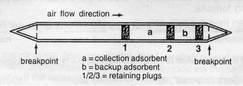

# Protocol for extraction of volatile organic compounds from ORBO charcoal traps

#### Materials

##### Reagent
- Dichloromethane (DCM)
- Tetraline (1,2,3,4-tetrahydronapthalene) (Internal standard)
  
##### Equipment
- Vacuum manifold
- Vacum pump (GAST® MOA-P101-JH,12V)
- Glass tube cutter
- 10ml syringe (tetraline standard only)
- 250ml syringe (dichloromethane only)
- GC vials with inserts and crimp caps
- Crimping tool
- Hooked needle for extraction of plastic retaining plugs

    

  **Figure 1**. ORBO™32 activated charcoal adsorption tube.  
  (Tubes should be oriented on the manifold so that plug **#1**  
  points down into the manifold).

##### Adsorption tube elution and VOC analysis

1. Flush the vacuum manifold with 500 microliters of dichloromethane (DCM) at least twice.
2. Place GC vials containing 300 microliter glass inserts into the vacuum manifold. You can label the tubes now, but I usually prefer to do it at the end after capping the vials. When replacing manifold lid, make sure that the Teflon solvent liners on the top of the manifold point go into the inserts.
3. Remove caps from adsorption tubes (let tubes dry if water accumulated during trapping). It usually helps to make a slit down the side of the cap using a razor blade.
4. Inspect cut ends of the traps. If necessary, re-cut the right hand side (Fig. 1) so the opening will be large enough to extract the plastic plugs.
5. Use a 10 ml syringe to inject 5ml of a 80mg/ml solution of tetraline (1,2,3,4-tetrahydronapthalene) in ethanol through the glass wool retaining plug (**#1** in Fig. 1) into the charcoal (collection) adsorbent (a in Fig. 1).
6. Use a hooked needle (insect pins work well) to remove the first retaining plug (**#3** in Fig. 1).
7. Invert tube and dump-out the backup adsorbent into waste container (b in Fig. 1).
8. Use the back of the needle (or some blunt object) to push down on retaining plug **#2** so that the collection adsorbent and retaining plug **#1** (glass wool) are pushed to the bottom of the tube (left hand side in Fig. 1)
9. Use the hooked needle to remove retaining plug **#2**. Make sure not to invert the tube after this step, or the collection adsorbent will fall out.
10. Attach the adsorption tubes to the vacuum manifold inlets with the glass wool plug (**#1**, Fig. 1) facing down. We use cut off 1000 μL pipette tips as adaptors for the vacuum manifold ports.
11. Elute the trap twice with 200 ml dichloromethane (DCM). Apply a brief vacuum pulse to elute solvent from the Teflon liner. Minimize runtime of pump to prevent excessive evaporation.
12. Quickly cap vials with crimp caps and label tubes. Vials can be stored at -80°C for a short time before running on the GC-MS.
